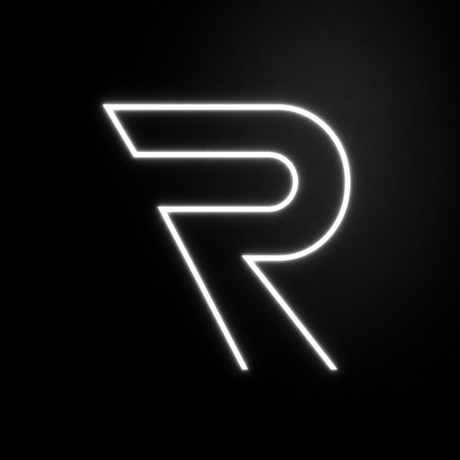

   
  
   
   

  <h1>🎮 RedLabel Tools - Steam Game Adder</h1>

  

    <b>Yeni Nesil Steam Kütüphane Yöneticisi, Online-Fix Çok Oyunculu Desteği ve Türkçe Yama Merkezi</b>
  

  

    
    
    
    
  

   

  

   
   

---

## ⚡ Özellikler

- 🎮 **Steam Kütüphane Yöneticisi:** Yüzlerce popüler oyunu tek tıkla Steam kütüphanenize entegre edin.
- 🌐 **Online-Fix & Çok Oyunculu Desteği:** Spacewar ve P2P altyapısıyla arkadaşlarınızla kesintisiz çevrim içi oynayın.
- 🇹🇷 **Türkçe Yama & Mod Merkezi:** Oyunlarınıza en güncel Türkçe yamaları ve eklentileri otomatik kurun.
- 🚀 **Turbo Game Booster:** RAM optimizasyonu, işlemci önceliği ve arka plan servis temizliğiyle maksimum FPS.
- 🛡️ **Canlı Discord Doğrulaması:** Resmi Discord sunucumuzla tam entegre, canlı rol ve üyelik güvenliği.
- 🔄 **Otomatik Güncelleme (Auto-Updater):** Yeni bir sürüm çıktığında tek tıkla otomatik olarak kendini günceller.

---

## 📥 Kurulum ve Başlangıç

1. [**Releases**](https://github.com/Redlabell1/Redlabel-Game-Adder/releases/latest) sekmesinden en son `RedLabel-Setup.exe` dosyasını indirin.
2. Kurulumu tamamlayın ve uygulamayı başlatın.
3. Lisans anahtarınız ve Discord hesabınızla doğrulamayı tamamlayıp kütüphanenizi yönetmeye başlayın!

---

## 💬 Topluluk ve Destek

Sorularınız, istekleriniz ve topluluk lobileri için resmi Discord sunucumuza bekleriz:  
👉 **[Discord Sunucumuza Katılın](https://discord.gg/Hek9SQJstW)**

---

  REDLABEL DEV 2026® | Tüm Hakları Saklıdır.

